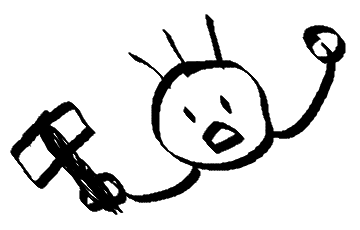

## 프로필

  
  
  

    <h2>대장장이</h2>
    <ul style="list-style: none; padding: 10; margin: 0;">
      <li><strong>🧑‍💻 백엔드 개발자</strong></li>
      <li><strong>🛠️ Java, Python</strong></li>
      <li><strong>✏️ 개발 관련 작업과 프로젝트 포트폴리오를 기록하는 공간입니다.</strong></li>
      <li>📬 <strong><a href="mailto:sojangjangi@gmail.com">sojangjangi@gmail.com</a></strong></li>
    </ul>
  

## 상세소개

🖐️ 안녕하세요. 소프트웨어 장인, 소장장이가 되고 싶은 대장장이입니다. 
